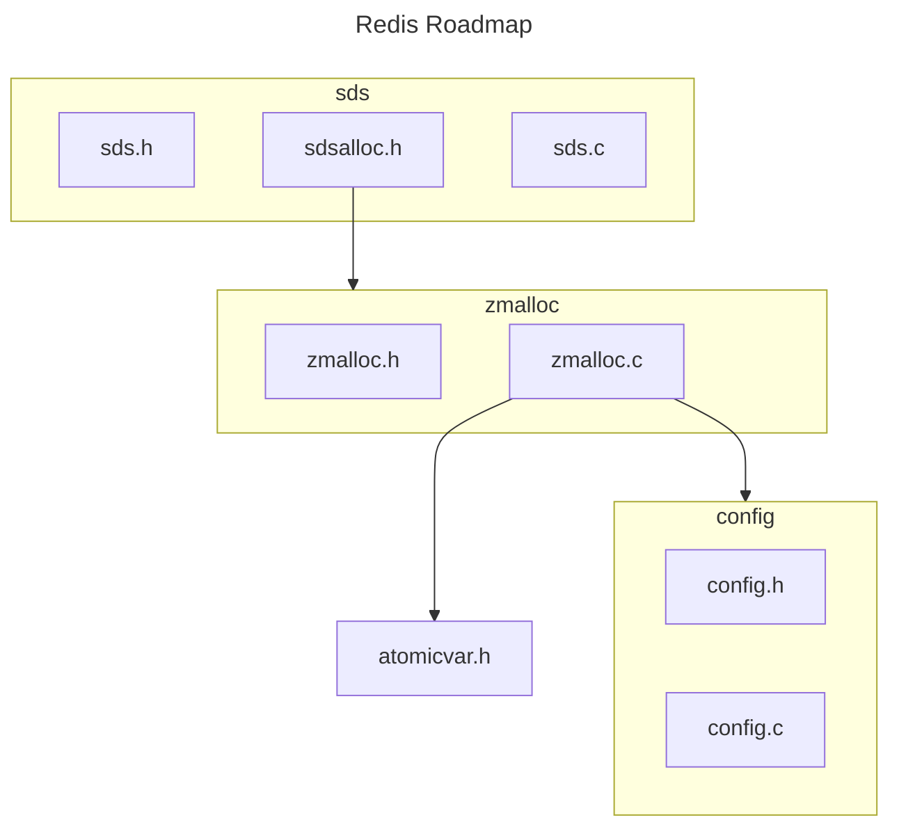

# Redis 源码笔记

```mermaid
---
title: Redis Roadmap
---
flowchart TD
    subgraph sds ["sds"]
        direction LR
        sds_h["sds.h"]
        sdsalloc_h["sdsalloc.h"]
        sds_c["sds.c"]
    end

    subgraph zmalloc ["zmalloc"]
        direction LR
        zmalloc_h["zmalloc.h"]
        zmalloc_c["zmalloc.c"]
    end

    subgraph config ["config"]
        direction LR
        config_h["config.h"]
        config_c["config.c"]
    end

    atomicvar_h["atomicvar.h"]

    sdsalloc_h --> zmalloc
    zmalloc_c --> atomicvar_h
    zmalloc_c --> config

    click sds_h href "https://github.com/redis/redis/blob/6.2.14/src/sds.h" _blank
    click sds_c href "https://github.com/redis/redis/blob/6.2.14/src/sds.c" _blank
    click sdsalloc_h href "https://github.com/redis/redis/blob/6.2.14/src/sdsalloc.h" _blank
    
    click zmalloc_h "https://github.com/redis/redis/blob/6.2.14/src/zmalloc.h" _blank
    click zmalloc_c "https://github.com/redis/redis/blob/6.2.14/src/zmalloc.c" _blank

    click config_h "https://github.com/redis/redis/blob/6.2.14/src/config.h" _blank
    click config_c "https://github.com/redis/redis/blob/6.2.14/src/config.c" _blank

    click atomicvar_h "https://github.com/redis/redis/blob/6.2.14/src/atomicvar.h" _blank
```

> 基于6.2.14版本  